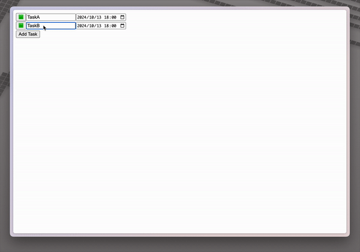

# Clapton


Clapton is a Ruby on Rails gem for building web apps with pure Ruby only (no JavaScript and no HTML templates).

## Stack

- Ruby on Rails
- Action Cable (WebSocket)
- [Ruby2JS](https://www.ruby2js.com/) (for compiling Ruby to JavaScript)
- [Morphdom](https://github.com/patrick-steele-idem/morphdom)
- importmap

## Installation

Add this line to your application's Gemfile:

```ruby
gem 'clapton'
```

And then execute:

    $ bundle install

## Usage

To use a Clapton component in your view:

```ruby
# app/components/task_list_component.rb
class TaskListComponent < Clapton::Component
  def render
    div = c(:div)
    @state.tasks.each do |task|
      div.add(TaskItemComponent.new(id: task[:id], title: task[:title], due: task[:due], done: task[:done]))
    end
    btn = c(:button)
    btn.add(c(:text, "Add Task"))
    btn.add_action(:click, :TaskListState, :add_task)
    div.add(btn)
  end
end

```

```ruby
# app/components/task_item_component.rb
class TaskItemComponent < Clapton::Component
  def render
    div = c(:div)
    btn = c(:button)
    btn.add(c(:text, @state.done ? "✅" : "🟩"))
    btn.add_action(:click, :TaskListState, :toggle_done)

    tf = c(:input, @state, :title)
    tf.add_action(:input, :TaskListState, :update_title)

    dt = c(:datetime, @state, :due)
    dt.add_action(:input, :TaskListState, :update_due)

    div.add(btn).add(tf).add(dt)
  end
end

```

```ruby
# app/states/task_list_state.rb
class TaskListState < Clapton::State
  attribute :tasks

  def add_task(params)
    task = Task.create(title: "New Task", due: Date.today, done: false)
    self.tasks << { id: task.id, title: task.title, due: task.due, done: task.done }
  end

  def toggle_done(params)
    task = Task.find(params[:id])
    task.update(done: !params[:done])
    self.tasks.find { |t| t[:id] == params[:id] }[:done] = task.done
  end

  def update_title(params)
    task = Task.find(params[:id])
    task.update(title: params[:title])
    self.tasks.find { |t| t[:id] == params[:id] }[:title] = task.title
  end

  def update_due(params)
    task = Task.find(params[:id])
    task.update(due: params[:due])
    self.tasks.find { |t| t[:id] == params[:id] }[:due] = task.due
  end
end
```

```ruby
# app/states/task_item_state.rb
class TaskItemState < Clapton::State
  attribute :id
  attribute :title
  attribute :due
  attribute :done
end
```

```ruby
# app/controllers/tasks_controller.rb
class TasksController < ApplicationController
  def index
    @tasks = Task.all
    @components = [
      [:TaskListComponent, { tasks: @tasks.map { |task| { id: task.id, title: task.title, due: task.due, done: task.done } } }]
    ]
  end
end
```

```html
# app/views/layouts/application.html.erb
<%= clapton_javascript_tag %>
```

```html
# app/views/tasks/index.html.erb
<%= clapton_tag %>
```

Make sure to include the necessary route in your `config/routes.rb`:

```ruby
mount Clapton::Engine => "/clapton"
```



### Component rendering

```html
<%= clapton_component_tag(
  :TaskListComponent,
  {
    tasks: @tasks.map { |task| { id: task.id, title: task.title, due: task.due, done: task.done } }
  }
) %>
```

### Generate Component and State

```bash
rails generate clapton TaskList
```

After running the generator, you will see the following files:

- `app/components/task_list_component.rb`
- `app/states/task_list_state.rb`

### Special Event

#### render

The `render` event is a special event that is triggered when the component is rendered.

```ruby
# app/components/task_list_component.rb
class TaskListComponent < Clapton::Component
  def render
    # ...
    div = c(:div)
    div.add_action(:render, :TaskListState, :add_empty_task, debounce: 500)
  end
end
```

### Effect

The `effect` method is a method that is triggered when the state is changed.

```ruby
# app/components/task_list_component.rb
class TaskListComponent < Clapton::Component
  effect [:tasks] do |state|
    puts state[:tasks]
  end
end
```

If dependencies are not specified, the effect will be triggered on the first render.

```ruby
# app/components/video_player_component.rb
class VideoPlayerComponent < Clapton::Component
  effect [] do
    puts "First render"
  end
end
```

### Streaming

Clapton supports streaming.

```ruby
# app/states/chat_state.rb
class ChatState < Clapton::State
  attribute :messages

  def send(params)
    self.messages << { role: "user", content: params[:content] }
    yield continue: true # Continue the streaming

    client = OpenAI::Client.new(
      access_token: ENV.fetch("OPENAI_ACCESS_TOKEN"),
      log_errors: true
    )
    self.messages << { role: "assistant", content: "" }
    client.chat(
      parameters: {
        model: "gpt-4o-mini",
        messages: messages,
        stream: proc do |chunk, _bytesize|
          if chunk.dig("choices", 0, "finish_reason") == "stop"
            yield continue: false # Stop the streaming
          end

          self.messages.last[:content] << chunk.dig("choices", 0, "delta", "content")
          yield continue: true
        end
      }
    )
  end
end
```

### Optional

#### Action Cable

Clapton uses Action Cable to broadcast state changes to the client.
If you want to identify the user, you can set the `current_user` in the connection.

```ruby
# app/channels/application_cable/connection.rb
module ApplicationCable
  class Connection < ActionCable::Connection::Base
    identified_by :current_user

    def connect
      self.current_user = find_verified_user
    end

    private

    def find_verified_user
      if verified_user = User.find_by(id: cookies.signed[:user_id])
        verified_user
      else
        reject_unauthorized_connection
      end
    end
  end
end
```

### Using with importmap-rails

Use `clapton_javascript_tag` instead of `javascript_importmap_tags`.

```diff
- <%= javascript_importmap_tags %>
+ <%= clapton_javascript_tag %>
```

### Events

#### clapton:render

The `clapton:render` event is a custom event that is triggered when the component is rendered.

```javascript
document.addEventListener("clapton:render", () => {
  console.log("clapton:render");
});
```

### Testing

#### RSpec

```ruby
# spec/spec_helper.rb
require "clapton/test_helper/rspec"

RSpec.configure do |config|
  config.include Clapton::TestHelper::RSpec, type: :component
end
```

```ruby
# spec/components/task_list_component_spec.rb

describe "TaskListComponent", type: :component do
  it "renders" do
    render_component("TaskListComponent", tasks: [{ id: 1, title: "Task 1", done: false, due: Time.current }])
    # You can use Capybara matchers here
    expect(page).to have_selector("input[type='text']")
  end
end
```

#### Minitest

```ruby
# test/test_helper.rb
require "clapton/test_helper/minitest"

class ActiveSupport::TestCase
  include Clapton::TestHelper::Minitest
end
```

```ruby
# test/components/task_list_component_test.rb
class TaskListComponentTest < ActiveSupport::TestCase
  test "renders" do
    render_component("TaskListComponent", tasks: [{ id: 1, title: "Task 1", done: false, due: Time.current }])
    # You can use Capybara matchers here
    assert_select "input[type='text']"
  end
end
```

## Deployment

Run `bundle exec rake clapton:compile` to compile the components.

`app/components` is codes that are compiled to JavaScript.
So, you need to ignore the directory from autoloading.

```ruby
# config/application.rb

Rails.autoloaders.main.ignore(Rails.root.join("app/components"))
```

## Development

After checking out the repo, run `bin/setup` to install dependencies. Then, run `bin/dev` to start the development server.

### Testing

Run `bundle exec rake test` to run the test suite.

Run `cd test/dummy && bundle exec rake test` to run the test suite for the dummy app.

Run `cd test/dummy && bundle exec rspec` to run the test suite for the dummy app with RSpec.

Run `cd lib/clapton/javascripts && npm run test` to run the test suite for the JavaScript part.

## Contributing

Bug reports and pull requests are welcome on GitHub at https://github.com/kawakamimoeki/clapton. This project is intended to be a safe, welcoming space for collaboration, and contributors are expected to adhere to the [code of conduct](https://github.com/kawakamimoeki/clapton/blob/main/CODE_OF_CONDUCT.md).

## License

The gem is available as open source under the terms of the [MIT License](https://opensource.org/licenses/MIT).
